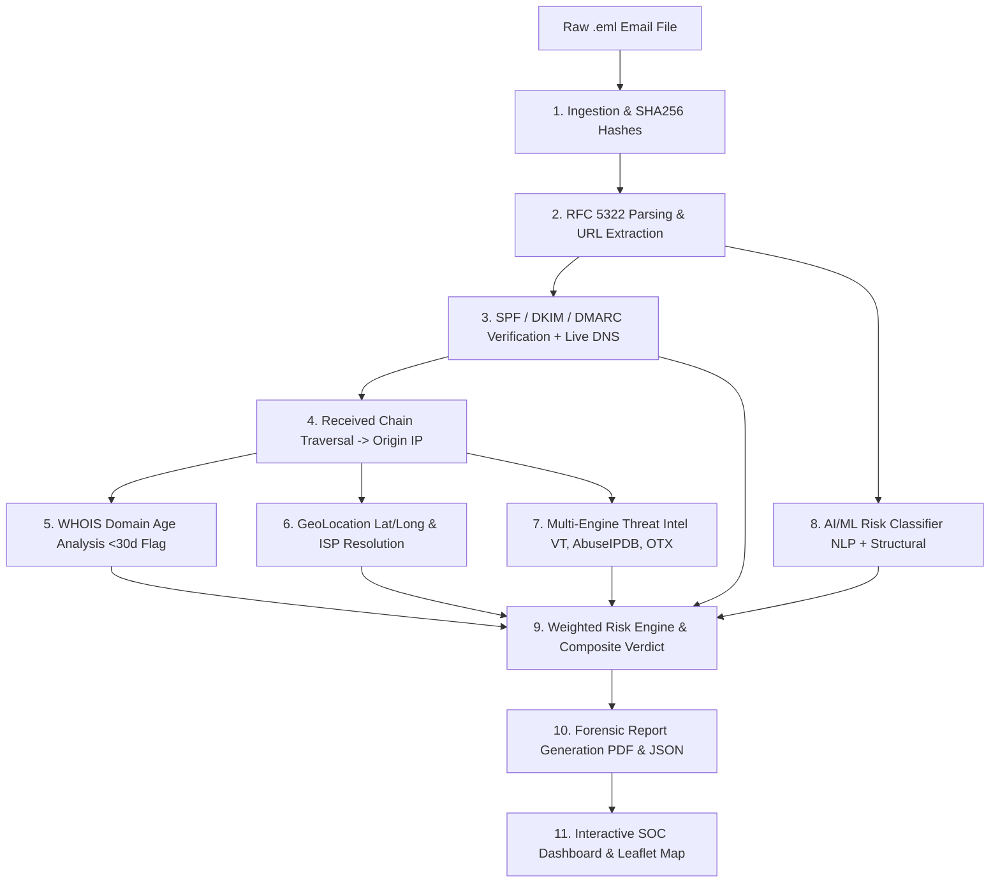

# SecureX: AI-Powered Email Threat Detection, GeoLocation & Forensic Intelligence Platform

**Platform:** SecureX Enterprise Cyber Defense  
**Tech Stack:** Python 3.11/3.12, FastAPI, Scikit-Learn, ReportLab, Leaflet.js, SQLite, Docker  

SecureX is an automated cybersecurity platform that ingests raw RFC 822/5322 email evidence (`.eml`), runs it through an 10-step forensic and threat intelligence pipeline, and outputs an explainable risk verdict with geolocation mapping and an exportable, court-admissible forensic report.

---

## Architecture & Forensic Pipeline

The platform executes the forensic intelligence pipeline in strict sequence:



### The 10-Step Pipeline Details:
1. **Ingestion:** Ingests raw `.eml` bytes, computes SHA-256 and MD5 cryptographic digests for digital evidence chain-of-custody.
2. **Parsing (`core/parser.py`):** Extracts `From`, `To`, `Reply-To`, `Return-Path`, `Message-ID`, timestamps, HTML/text body, attachments, and flags deceptive link mismatches (anchor text vs. destination `href`).
3. **Authentication Check (`core/auth_check.py`):** Evaluates `Authentication-Results`, `Received-SPF`, and `DKIM-Signature` headers. Falls back to live DNS TXT lookups via `dnspython` for SPF and `_dmarc.<domain>`.
4. **Origin IP Extraction (`core/origin_ip.py`):** Walks the RFC 5322 `Received` headers bottom-to-top (chronological order), skips private (RFC 1918) and internal IPs, and identifies the authoritative external origin IP.
5. **WHOIS & Domain Age (`core/whois_lookup.py`):** Queries WHOIS records for the sender domain. Flags newly registered domains (<30 days) as high-risk threat indicators.
6. **GeoLocation (`core/geo.py`):** Resolves origin IP to country, city, coordinates (lat/long), ISP, and AS number.
7. **Threat Intelligence (`core/threat_intel.py`):** Queries VirusTotal v3, AbuseIPDB v2, and AlienVault OTX with rate-limiting cache and fallback signatures.
8. **AI/ML Risk Classifier (`core/classifier.py`):** Combines NLP text vectorization (TF-IDF, urgency cues, generic greetings) with structural security features via a trained `RandomForestClassifier`.
9. **Weighted Risk Engine (`core/risk_scorer.py`):** Synthesizes all pillars into a normalized 0–100 risk score and categorical verdict:
   - **Clean** (<30)
   - **Suspicious** (30–69)
   - **Malicious** (≥70)
10. **Forensic Report (`core/report.py`):** Auto-generates exportable forensic PDF (using ReportLab) and raw structured JSON with header transcripts and custody hashes.

---

## Directory Structure

```
SecureX/
├── app.py                 # FastAPI application & REST endpoints
├── config.py              # Application settings & environment loader
├── database.py            # SQLite database models & audit trail
├── core/
│   ├── pipeline.py        # Master pipeline coordinator (Steps 1–10)
│   ├── parser.py          # Email RFC parsing & deceptive URL extraction
│   ├── auth_check.py      # SPF/DKIM/DMARC header & live DNS checking
│   ├── origin_ip.py       # Bottom-to-top Received hop IP extractor
│   ├── whois_lookup.py    # WHOIS queries & domain age calculation
│   ├── geo.py             # IP-API / GeoIP coordinate & ISP resolution
│   ├── threat_intel.py    # VirusTotal, AbuseIPDB, AlienVault OTX integration
│   ├── classifier.py      # AI/ML classifier with explainable NLP features
│   ├── risk_scorer.py     # Weighted composite risk scoring engine
│   └── report.py          # PDF (ReportLab) & JSON forensic report builder
├── ml/
│   ├── train.py           # Model training pipeline
│   └── model.pkl          # Serialized model & TF-IDF bundle
├── samples/               # 3 demo test email evidence files
│   ├── clean_sample.eml   # Legitimate GitHub security notification
│   ├── phishing_sample.eml# Microsoft credential harvest with spoofed links
│   └── spoofed_sample.eml # Executive wire transfer fraud with SPF failure
├── templates/
│   └── index.html         # Interactive SOC analyst dashboard
├── static/
│   ├── css/style.css      # Dark-mode styling
│   └── js/dashboard.js    # Upload handlers & Leaflet map renderer
├── test_pipeline.py       # Comprehensive integration test suite
├── Dockerfile             # Docker container configuration
├── docker-compose.yml     # Docker Compose orchestration
├── requirements.txt       # Python dependencies
└── .env.example           # Environment variables template
```

---

## Installation & Setup

### 1. Prerequisites
- Python 3.11+
- Git

### 2. Clone and Install Dependencies
```bash
# Clone or navigate to the directory
cd SecureX

# Install required packages
pip install -r requirements.txt
```

### 3. Configure API Keys (Optional)
Copy `.env.example` to `.env` and fill in your free tier API keys:
```bash
cp .env.example .env
```
*(Note: SecureX has built-in offline mock fallbacks, so the pipeline works even without API keys!)*

### 4. Train the ML Model
Generate the model artifact:
```bash
python ml/train.py
```

### 5. Run Integration Tests
Verify steps 1–10 against all 3 sample emails:
```bash
python test_pipeline.py
```

### 6. Launch the Platform
Start the FastAPI server:
```bash
python -m uvicorn app:app --host 0.0.0.0 --port 8000 --reload
```
Open your browser and navigate to:
**http://localhost:8000**

---

## Docker Deployment

To launch SecureX inside a standalone Docker container:
```bash
docker-compose up --build
```
Access the dashboard at `http://localhost:8000`.

---

## Sample Test Emails Included

SecureX ships with 3 pre-configured sample emails for testing:

1. **Clean Sample (`clean_sample.eml`):**
   - Legitimate GitHub Dependabot alert.
   - Origin IP: `140.82.112.21` (GitHub, San Francisco).
   - Valid SPF & DKIM passing headers.
   - Result: **CLEAN (Score: ~5/100)**.

2. **Phishing Sample (`phishing_sample.eml`):**
   - Fake Microsoft 365 credential verification.
   - Origin IP: `185.220.101.5` (Russian VPS/Tor exit node).
   - Anchor text claims `https://login.microsoftonline.com`, but destination points to `http://login-security-update-993.top`.
   - Failing SPF authorization.
   - Result: **MALICIOUS (Score: ~89/100)**.

3. **Spoofed Executive Wire Fraud (`spoofed_sample.eml`):**
   - CEO impersonation wire request for $84,500.
   - Origin IP: `194.26.29.112` (Offshore hosting).
   - Mismatched `Reply-To` and `Return-Path`.
   - Softfail SPF status.
   - Result: **MALICIOUS / SUSPICIOUS (Score: ~78/100)**.

---

## API Endpoints

- `GET /` — Web Dashboard UI with Leaflet.js interactive map.
- `POST /api/analyze` — Multipart `.eml` upload for instant analysis.
- `GET /api/sample/{clean|phishing|spoofed}` — Quick 1-click sample test.
- `GET /api/reports/{id}/pdf` — Download official Forensic PDF Report.
- `GET /api/reports/{id}/json` — Export raw structured JSON evidence.
- `GET /api/history` — Fetch recent analyses and audit trails.
