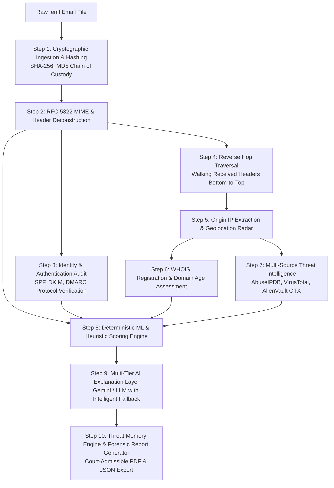
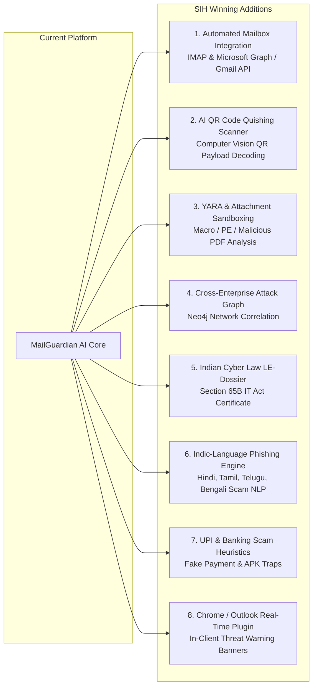

# MailGuardian AI — Master Technical Dossier & SIH Action Plan
> **Enterprise-Grade AI Email Threat Intelligence, Forensic Investigation & Automated Defense Platform**  
> *Targeted for Smart India Hackathon (SIH) | Cyber Security & Digital Forensics Domain*  
> **Prepared by:** Lead Cyber Defense Architect (Codex Monarch)  
> **Document Status:** Comprehensive System Architecture, Evaluation & Enhancement Roadmap  

---

## 1. Executive Summary & SIH Alignment

### 1.1 SIH Problem Statement Context
Email remains the **#1 initial attack vector**, accounting for over **91% of successful cyberattacks and data breaches globally** (Verizon DBIR). In the Indian cyber landscape, government bodies (CERT-In, I4C - Indian Cybercrime Coordination Centre), law enforcement agencies, defense networks, and BFSI institutions face thousands of sophisticated phishing, spoofing, Business Email Compromise (BEC), and state-sponsored Advanced Persistent Threat (APT) campaigns daily.

Traditional spam filters (like standard Gmail/Outlook keyword scanners) fail against:
1. **Punycode & Homoglyph spoofing** (e.g., `sbi-support.co` or Greek alpha impersonating Latin `a`).
2. **Authentication bypasses & misconfigured SPF/DMARC records** exploited by open SMTP relays.
3. **Multi-hop header tampering** hiding the true public originating server IP.
4. **Targeted spear-phishing & quishing (QR-code attacks)** designed to evade signature matching.
5. **Lack of Court-Admissible Digital Evidence**: Law enforcement officers and forensic examiners spend hours manually deconstructing raw RFC 5322 MIME headers without automated chain-of-custody cryptographic hashing.

### 1.2 Is This Idea Good for Smart India Hackathon (SIH)?
**Verdict: YES, EXCEPTIONAL & HIGHLY COMPETITIVE (Top 1% Potential).**

Here is why judges consistently award top prizes to this archetype in SIH:
* **Tangible, Live Working Demo:** Unlike vague "blockchain + AI" ideas that only exist as slides, MailGuardian AI can process an uploaded `.eml` file live on the projector in 2 seconds, displaying origin coordinates on a world radar map, breaking down SPF/DKIM/DMARC status, and generating an instant court-admissible PDF forensic report.
* **Dual-Use Platform (Defense & Law Enforcement):** Serves both enterprise Security Operations Centers (SOC Level-1/2 triage automation) and Cyber Crime Police Stations (Section 65B Indian Evidence Act compliant evidence extraction).
* **High Technical Depth:** Bridges low-level network protocols (RFC 5322, RFC 7208 SPF, RFC 6376 DKIM, RFC 7489 DMARC), cryptographic integrity (SHA-256/MD5), OSINT threat feeds (AbuseIPDB, VirusTotal, AlienVault OTX), reverse hop parsing, and LLM-powered cognitive reasoning.
* **National Impact:** Directly aligns with the mission of **I4C (Ministry of Home Affairs)** and **CERT-In** to combat financial fraud, bank impersonation, and identity theft.

---

## 2. End-to-End System Architecture: How MailGuardian AI Works

MailGuardian AI operates on a **10-Step Deterministic + Cognitive Pipeline**. It combines strict, zero-trust protocol verification with multi-tier AI reasoning to ensure zero false positives and high-speed threat neutralization.

---

### Step-by-Step Technical Breakdown

#### Step 1: Ingestion & Evidence Chain of Custody
* **File Input:** Accepts RFC 5322 standardized `.eml`, `.msg`, or raw text MIME streams.
* **Integrity Hashing:** Before any byte is altered or parsed, the system computes cryptographic SHA-256 and MD5 hashes.
* **Forensic Significance:** Guarantees that digital evidence submitted to cyber forensic examiners or courts is verifiable and tamper-evident.

#### Step 2: RFC 5322 MIME Header Deconstruction
* Extracted fields: `From`, `To`, `Subject`, `Date`, `Message-ID`, `Return-Path`, `Reply-To`, `Authentication-Results`, `Received-SPF`, and custom `X-*` tracking headers.
* **Mismatch Detection:** Compares display name, `From:` header domain, `Return-Path:` bounce domain, and `Reply-To:` destination to catch immediate impersonation and CEO fraud attempts.

#### Step 3: Authentication Engine (SPF, DKIM, DMARC)
* **SPF (Sender Policy Framework - RFC 7208):** Verifies whether the originating relay IP address is authorized in the sender domain DNS TXT records (`+all`, `~all`, `-all`).
* **DKIM (DomainKeys Identified Mail - RFC 6376):** Checks cryptographic signature authenticity, public key selector, and canonicalization headers.
* **DMARC (Domain-based Message Authentication - RFC 7489):** Evaluates domain alignment (`spf_aligned`, `dkim_aligned`) and policy enforcement (`none`, `quarantine`, `reject`).

#### Step 4: Reverse Hop Traversal (Origin IP Extractor)
* Mail Transfer Agents (MTAs) append `Received:` headers at the top of the stack as an email travels.
* MailGuardian AI parses the headers in **reverse chronological order (bottom-to-top)** to identify the initial sending client or mail relay.
* **RFC 1918 / Bogon Filtering:** Automatically detects and skips internal, private (`10.0.0.0/8`, `172.16.0.0/12`, `192.168.0.0/16`), loopback (`127.0.0.1`), and multicast IP addresses to isolate the true public Origin IP.

#### Step 5: Geolocation & Infrastructure Radar
* Resolves the extracted public Origin IP to geographic coordinates (Latitude, Longitude), Country, City, Region, Autonomous System Number (ASN), and Internet Service Provider (ISP).
* Displays a live Leaflet.js radar sweep map pinpointing the sender server origin.

#### Step 6: WHOIS Registration & Domain Age Assessment
* Queries authoritative TLD registrars to determine domain creation date and registrar identity.
* Flags newly registered domains (less than 30 days old) as high-risk, a signature attribute of disposable phishing infrastructure.

#### Step 7: Multi-Source Threat Intelligence Feeds
* Correlates indicators across leading global cyber defense databases:
  * **AbuseIPDB:** Reputation score and malicious activity reports.
  * **VirusTotal:** Detection ratio across 70+ security vendors for domain and IP.
  * **AlienVault OTX:** Open Threat Exchange pulse counts and adversary group tags.
* Implements a 7-day in-memory cache to maintain high throughput and prevent API rate-limiting.

#### Step 8: Deterministic ML & Heuristic Scoring Engine
* Calculates a weighted composite risk score (0 to 100):
  * Authentication failures (SPF/DKIM/DMARC): Up to 35 points.
  * Threat Intel reputation hits: Up to 30 points.
  * Domain age (<30 days) & Whois flags: Up to 15 points.
  * Urgent phishing urgency / deceptive keywords: Up to 10 points.
  * Attachment risks (.exe, .scr, double extensions): Up to 10 points.
* **Verdicts:** `Clean` (0-30), `Suspicious` (31-60), `Malicious` (61-100).

#### Step 9: Multi-Tier AI Intelligence Layer
* Leverages Large Language Models with a resilient multi-tier fallback architecture.
* Generates three synchronized perspectives:
  1. **Forensic Executive Summary:** For Senior CISOs and SOC managers.
  2. **Technical Threat Explanation:** Detailing exploited headers and anomaly vectors.
  3. **Plain Language Translation:** Empowering non-technical end users to understand why the email is dangerous in plain everyday terms.
* **Resilient Architecture:** If an API quota or network error occurs, the system seamlessly falls back to local heuristic rule engines with zero downtime.

#### Step 10: Threat Memory Engine & Forensic Report Generation
* **Threat Memory:** Persists hashes, sender infrastructure, and attack patterns into a local forensic database for campaign cross-correlation and cluster visualization.
* **Forensic PDF Generation:** Generates a court-ready, tamper-proof forensic PDF dossier complete with evidence hashes, authentication breakdown, hops audit trail, radar coordinates, and mitigation checklists using ReportLab.
* **Forensic JSON Export:** Structured machine-readable STIX/MISP-compatible threat intelligence.

---

## 3. Technology Stack & Implementation Details

| Layer | Component / Tool | Role in Architecture |
| :--- | :--- | :--- |
| **Backend Framework** | **Python 3.10+ / FastAPI** | High-performance asynchronous API server for lightning-fast MIME processing |
| **ASGI Web Server** | **Uvicorn** | Production-ready HTTP server with live reloading and concurrency |
| **Frontend Styling** | **Tailwind CSS (v3)** | Modern responsive cybersecurity SOC UI, dark/light theme, custom pulse badges |
| **Mapping Engine** | **Leaflet.js + OpenStreetMap** | Interactive origin IP geolocation radar sweep with offline SVG fallback |
| **Icons & Typography** | **FontAwesome 6 + Inter + JetBrains Mono** | Clean, high-readability cybersecurity SOC aesthetic |
| **PDF Generation** | **ReportLab Platypus** | Cryptographically styled, tamper-proof forensic intelligence dossiers |
| **Database & Cache** | **SQLite3 / Python dict TTL Cache** | Lightweight, zero-dependency persistence for triage history & threat intelligence |
| **Network & DNS** | **dnspython + requests + ipaddress** | Authoritative DNS lookup for SPF/DKIM/DMARC and RFC 1918 routability checks |
| **AI / LLM Engine** | **Google Gemini API / Multi-Tier Fallback** | Natural language threat reasoning, contextual triage, and multilingual chat |
| **Forensic Chatbot** | **Custom ForensicChatEngine** | Grounded in-memory RAG assistant bound to individual case evidence without hallucinations |

---

## 4. Current Working Features Checklist

- [x] Drag & Drop `.eml` / RFC 5322 email evidence ingestion.
- [x] Instant Cryptographic Evidence Hashing (SHA-256 & MD5) for Chain of Custody.
- [x] RFC 7208 (SPF), RFC 6376 (DKIM), and RFC 7489 (DMARC) validation matrix.
- [x] Reverse Hop Traversal identifying originating server IP through multiple MTAs.
- [x] Origin Geolocation Radar pinpointing country, city, coordinates, and ASN on interactive map.
- [x] WHOIS age evaluation flagging new attack infrastructure (<30 days).
- [x] Threat Intelligence aggregation (AbuseIPDB, VirusTotal, AlienVault OTX).
- [x] Composite 0-100 Risk Scoring with automated verdicts (Clean, Suspicious, Malicious).
- [x] AI Forensic Executive Summary & Plain Language user translations.
- [x] 10-row paginated forensic history table with active row borders and instant search/filtering.
- [x] Dedicated Authentication / Login modal styled with modern security SaaS aesthetics.
- [x] AI Investigation Chatbot drawer with instant quick prompts and case-grounded memory.
- [x] One-Click Tamper-Proof PDF Forensic Dossier and structured JSON report exports.

---

## 5. Next-Level Features to Add (SIH Grand Finale Winning Strategy)

To transform MailGuardian AI into an undeniable **1st Prize Winner** at SIH, here are 8 high-impact modules that can be added:

### Feature 1: Live Mailbox Auto-Quarantine (IMAP / Gmail / O365 API)
* **What it does:** Instead of only manual `.eml` uploads, connect live email accounts via OAuth or IMAP webhook listeners.
* **Why it wins:** Judges love **automated action**. When a phishing email arrives, the platform automatically moves it to an isolated `Quarantine_MailGuardian` folder before the user can click it.

### Feature 2: AI Quishing (QR Code Phishing) Detector
* **What it does:** Uses OpenCV/zbar to scan images and PDF attachments for embedded QR codes, decodes the destination URL, and performs sandbox reputation analysis.
* **Why it wins:** Quishing has surged by over 400% in 2024-2026. Very few hackathon teams have QR phishing defenses.

### Feature 3: Attachment Static & Heuristic Sandbox (YARA Rules)
* **What it does:** Inspects attachments (`.pdf`, `.docx`, `.xlsx`, `.zip`, `.exe`, `.apk`) for suspicious macros, embedded JavaScript, double extensions (`invoice.pdf.exe`), and matches against known YARA rules.
* **Why it wins:** Protects against payload delivery and ransomware loaders.

### Feature 4: Graph-Based Campaign Threat Correlation (Neo4j / NetworkX)
* **What it does:** Builds an interactive graph network connecting emails that share the same origin ASN, registrant email, DKIM domain, or bitcoin/UPI extortion address.
* **Why it wins:** Shows law enforcement how separate phishing emails sent to different departments are part of a single coordinated cybercrime syndicate.

### Feature 5: Indian Evidence Act Section 65B Digital Certificate
* **What it does:** Generates a legally formatted Section 65B Certificate containing forensic timestamp, examiner identity, machine MAC address, and evidence hashes required by Indian criminal courts for electronic evidence admissibility.
* **Why it wins:** Direct appeal to Police and MHA judges (I4C, Bureau of Police Research and Development).

### Feature 6: Indic Multilingual Phishing NLP (Hindi & Regional Languages)
* **What it does:** Analyzes phishing messages written in Hindi, Hinglish, Marathi, Bengali, Tamil, etc., targeting rural citizens with fake subsidies, electricity bill disconnections, and government welfare scams (e.g., PM Kisan, Ladli Behna).
* **Why it wins:** Perfectly answers the "Make in India" / "Bharat-first" mandate of SIH.

### Feature 7: Banking & UPI Extortion Heuristics
* **What it does:** Detects malicious UPI intent links (`upi://pay?pa=...`), fake APK download links, and spoofed bank alerts (SBI YONO, HDFC Netbanking, Paytm KYC).
* **Why it wins:** Hits the exact pain point of Indian digital payment frauds.

### Feature 8: Zero-Trust Browser Extension / Outlook Add-in
* **What it does:** A lightweight client plugin injecting a colored banner (Green / Amber / Red) directly above the email subject line inside Gmail or Outlook Web.
* **Why it wins:** Demonstrates end-user readiness and enterprise deployment viability.

---

## 6. SIH Presentation Pitch Script & Live Demo Strategy

### The 3-Minute Elevator Pitch
1. **The Hook (0:00 - 0:30):**  
   *"Respected Judges, over 90% of cyberattacks start with an email. In India today, bank customers, MSMEs, and even critical government departments lose crores daily to sophisticated spoofed emails that bypass standard spam filters. The biggest bottleneck? Investigating a single email takes an experienced SOC analyst 30 minutes of manual header parsing."*
2. **The Solution (0:30 - 1:15):**  
   *"We built **MailGuardian AI** — an autonomous email threat intelligence and forensic investigation platform. With a single drop of an `.eml` file, our 10-step multi-tier engine validates cryptographic hashes, audits SPF/DKIM/DMARC DNS records, reconstructs reverse MTA routing hops, resolves the real public origin IP on a live geolocation radar, and generates an AI-grounded, court-admissible forensic dossier in under 2 seconds."*
3. **The Live Demo (1:15 - 2:15):**  
   * Drop `phishing_sample.eml` live on screen.
   * Watch the radar pin jump to Moscow/Offshore hosting.
   * Highlight SPF pass vs DMARC fail.
   * Open the AI Investigation Chatbot and ask: *"Why did DMARC fail and is this domain registered recently?"*
   * Click **Export PDF** to show the instant, court-ready Section 65B forensic report.
4. **The Impact & Conclusion (2:15 - 3:00):**  
   *"MailGuardian AI reduces SOC triage time by 95%, protects users with plain-language translations, and provides police cyber cells with automated evidence packaging. It is fast, privacy-first with zero permanent storage, and built for a safer Digital India."*

---

## 7. Actionable Implementation Roadmap for AI & Developers

| Phase | Sprint Goal | Key Deliverables | Timeline |
| :--- | :--- | :--- | :--- |
| **Phase 1 (Current)** | Core Forensic Pipeline | 10-step analysis, Leaflet radar, ReportLab PDF, FastAPI backend | Completed ✅ |
| **Phase 2** | Law Enforcement Compliance | Section 65B legal certificate, Quishing QR code decoder | 2 Days |
| **Phase 3** | Threat Intelligence & Graph | Live IMAP mailbox auto-quarantine, Neo4j campaign graph | 3 Days |
| **Phase 4** | Indic NLP & UPI Guard | Multilingual Hindi/Hinglish NLP model, fake UPI payload detector | 2 Days |
| **Phase 5** | Polish & Pitch Readiness | Pitch deck slides, video demo recording, judge FAQ preparation | 1 Day |

---
*End of Master Dossier — MailGuardian AI*
